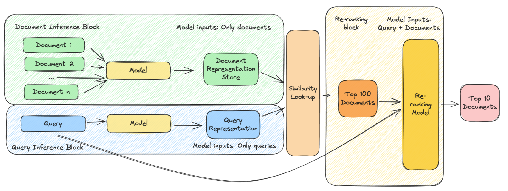

# Curator: Context-Driven Course Recommendations

## Overview

Curator is a command-line tool designed to provide context-driven course recommendations based on user queries. It uses advanced natural language processing techniques to match user inputs with relevant courses from a Cosmo export.

## Software Design

### Command Line Usage

Basic usage:
```
curate "your course query here"
```

This returns the top 5 most relevant courses by default.

### Arguments

- First positional argument (str): User query (optional)
- `-i`, `--input_file` (str): Input filename (CSV, TXT, or Excel; data should be in the first column)
- `-o`, `--output_file` (str): Output filename for results
- `-n`, `--original_batch_size` (int): Number of initial results to retrieve (default: 50)
- `-k`, `--number_responses` (int): Number of final recommendations to return (default: 5)
- `-s`, `--status`: Print the status of the application
- `-r`, `--readme`: Print this readme

## How It Works




1. **Data Source**: The script uses a Cosmo export (Excel file) containing course titles and descriptions.

2. **Data Preprocessing**:
   - Filters for active courses
   - Includes courses released or updated after January 1, 2018
   - Cleans text data (removes HTML, handles encoding issues)

3. **Vector Database**: 
   - Creates embeddings of course descriptions using ChromaDB
   - Stores these embeddings in a persistent vector database for quick similarity searches

4. **Query Processing**:
   - Converts user queries into embeddings
   - Performs a similarity search against the course description embeddings

5. **Reranking**:
   - Uses a locally-hosted LLM reranking model (BAAI/bge-reranker-large) to improve recommendation quality
   - Reranks the initial results based on relevance to the query

6. **Output**: 
   - Returns the top k results (default k=5, can be modified)

Note: This script uses only locally-hosted code, ensuring data security.

## MacOS Installation for users new to Python (and command line)

**Install homebrew if necessary**

`/bin/bash -c "$(curl -fsSL https://raw.githubusercontent.com/Homebrew/install/HEAD/install.sh)"` 
 
Use Homebrew to install the latest version of Python:                        
`brew install python`
 
Verify the installation (you need at least Python version 3.7):
`python3 --version`

**Install the repo**
`git clone https://github.com/acesanderson/Curator`

**Go to repo**
`cd Curator`

**Requirements**
`pip install -r requirements.txt`

**Download Cosmo export into same folder**

Brian can provide link to the cosmo export.

**Start Curator**
`python3 Curate.py`

## How to Use

==Depending on your system, you may need to use `python3` instead of `python` in the below example.==

1. **First-time setup**:
   - Run the script. It will automatically create the vector database on first run.
   ```
   python curate.py
   ```

2. **Basic query**:
   ```
   python curate.py "your course query here"
   ```

3. **Batch processing from file**:
   ```
   python curate.py -i input_file.csv -o results.txt
   ```

4. **Adjusting result count**:
   ```
   python curate.py "query" -k 10
   ```

5. **Check application status**:
   ```
   python curate.py -s
   ```

## Best Practices

- Provide detailed queries for better results. The script matches your query to courses based on semantic similarity to their descriptions.
- While course titles can work as queries, you'll get better results by providing more context.
- For batch processing, ensure your input file has one query per line or in the first column.

## Maintenance

- The script automatically checks if the Cosmo export has been updated and refreshes the vector database accordingly.
- To force a complete rebuild of the vector database, delete the `.chroma_database` directory and `.date_manifest` file, then run the script again.

## Troubleshooting

- If you encounter any issues, first ensure all dependencies are correctly installed and that the Cosmo export file is present and up-to-date.
- Check the application status using the `-s` flag for diagnostics.

For further assistance or to report issues, please contact Brian Anderson at bianderson@linkedin.com.
